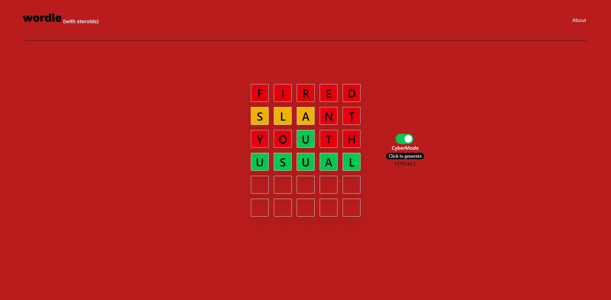

# Wordle Cyborg

A Full Stack Wordle Clone featuring an integrated AI assistant powered by Information Theory.


_(Note: Replace this image with a screenshot of your actual game!)_

## About The Project

Wordle Cyborg isn't just a game clone; it's an exploration of **Symbolic AI**.

It features a "Cyborg Mode" toggle. When activated, the UI transforms, and the user can request help from a Python backend. The backend doesn't just look up the answer; it calculates **Shannon Entropy** to determine the mathematically optimal next guess to narrow down the remaining possibilities.

## Tech Stack

**Frontend (The Face):**

- **React (Vite):** Fast, component-based UI.
- **Tailwind CSS:** Fully responsive mobile-first styling.
- **Framer Motion:** Complex animations (Tile pop, flip reveal, error shake).
- **Axios:** Handling API requests to the backend.

**Backend (The Brain):**

- **Python (Flask):** Lightweight REST API.

## Features

- **Classic Gameplay:** Full implementation of Wordle rules (Green/Yellow/Gray logic).
- **Responsive Design:** optimized for both Desktop and Mobile experiences.
- **Cyborg Mode:**
  - Visual transformation (Theme changes from White/Black to Red/Cyborg).
  - "Ask Cyborg" button that queries the Python API.
- **Smart Algorithm:** The solver filters valid candidates based on game history and ranks guesses by "Information Gain" (Entropy).

## How to Run Locally

You will need two terminal windows open (one for the backend, one for the frontend).

### 1. Backend Setup (Python)

Navigate to the backend folder:

```bash
cd backend
```

Create and activate a virtual environment:

```bash
# Windows
python -m venv venv
venv\Scripts\activate

# Mac/Linux
python3 -m venv venv
source venv/bin/activate
```

Install dependencies:

```bash
pip install flask flask-cors
```

Run the server:

```bash
python src/app.py
```

Runs at http://127.0.0.1:5000

Frontend setup

```bash
cd frontend
npm install
npm run dev
```
